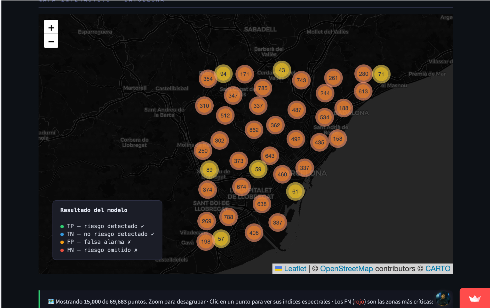
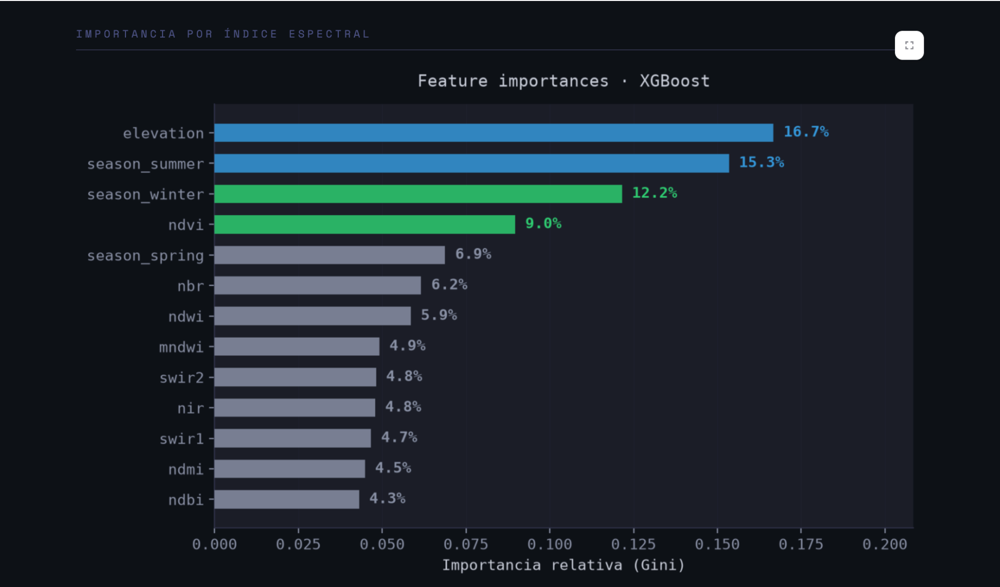

# Urban Heat Island Risk Prediction in Barcelona

## Overview

This project develops an end-to-end Machine Learning solution capable of identifying **Urban Heat Island (UHI) risk areas** in Barcelona using satellite imagery, environmental indicators, and geospatial data.

The objective was to determine whether it is possible to predict urban heat risk **without using temperature measurements as model inputs**, relying instead on spectral signatures extracted from publicly available satellite data.

🔗 **Live Demo:** https://uhi-risk-model.streamlit.app/

<h3 align="center">Urban Heat Island Risk Map</h3>

  

<h3 align="center">Feature Importance Analysis</h3>

  

---

## Business Problem

Urban Heat Islands (UHI) are areas within cities that retain significantly more heat than their surrounding environment, particularly during the night.

This phenomenon is associated with:

- High building density
- Limited vegetation coverage
- Impermeable urban surfaces
- Reduced water presence

UHI affects public health, energy consumption, and overall quality of life in urban environments.

Traditional monitoring depends on temperature sensors with limited spatial coverage. This project explores whether satellite imagery can be used to identify high-risk areas at scale.

---

## Project Goal

Develop a Machine Learning model capable of predicting Urban Heat Island risk in Barcelona using satellite-derived environmental indicators.

The solution aims to:

- Identify areas with a higher probability of heat accumulation.
- Support large-scale environmental monitoring.
- Provide actionable insights for urban planning and sustainability initiatives.
- Evaluate whether spectral and environmental indicators alone can serve as reliable predictors of UHI risk.

---

## Dataset

The dataset was generated using Google Earth Engine by combining Sentinel-2 and MODIS satellite products.

### Dataset Characteristics

- **69,683 geospatial observations**
- **Barcelona metropolitan area**
- **Period: 2020–2025**
- **14 predictive variables**
- Binary target variable (**uhi_risk**)

The target variable was derived from nighttime thermal anomalies calculated from MODIS Land Surface Temperature measurements.

---

## Data Sources

### Sentinel-2

Environmental indicators and spectral indices:

- NDVI (Normalized Difference Vegetation Index)
- NDWI (Normalized Difference Water Index)
- NDBI (Normalized Difference Built-up Index)
- NBR (Normalized Burn Ratio)
- MNDWI (Modified NDWI)
- NDMI (Normalized Difference Moisture Index)
- NIR
- SWIR1
- SWIR2

### MODIS

Used to calculate:

- Land Surface Temperature (Day)
- Land Surface Temperature (Night)
- Thermal anomalies

### Additional Variables

- Elevation
- Seasonal information
- Geographic coordinates (latitude and longitude)

### Google Earth Engine

Used for satellite image acquisition, filtering, processing, and dataset generation.

---

## Machine Learning Approach

Three supervised learning algorithms were initially evaluated:

| Model | Accuracy | Recall (Risk) | F1 Score (Risk) |
|---------|---------|---------|---------|
| XGBoost | 0.72 | 0.75 | 0.74 |
| Random Forest | 0.71 | 0.73 | 0.72 |
| SVM | 0.71 | 0.75 | 0.73 |

These initial experiments included geographic coordinates as predictive features.

XGBoost achieved the best overall performance and was selected for further analysis.

### Feature Importance Analysis

The model identified elevation, seasonal patterns, vegetation coverage (NDVI), and spectral indicators as the most relevant predictors of Urban Heat Island risk.

---

## Generalization Experiment

A second experiment was conducted to evaluate whether the model was relying excessively on geographic coordinates.

Latitude and longitude were intentionally removed from the feature set to reduce spatial leakage and test the model's ability to generalize to unseen locations.

### Final Production Model

| Model | Accuracy | Recall (Risk) | F1 Score (Risk) |
|---------|---------|---------|---------|
| XGBoost (Without Coordinates) | 0.68 | 0.73 | 0.71 |

Although performance decreased slightly, the model maintained strong predictive capability while becoming less dependent on memorizing specific geographic locations.

This trade-off was considered beneficial because the objective was not to predict heat risk in known neighborhoods of Barcelona, but to build a model capable of learning environmental patterns associated with Urban Heat Islands.

For this reason, the coordinate-free XGBoost model was selected as the final production model and deployed in the Streamlit application.

---

## Results

The project demonstrates that Urban Heat Island risk can be predicted using publicly available satellite imagery and environmental indicators without requiring direct temperature measurements as model inputs.

The final model successfully captures environmental patterns associated with urban heat accumulation and provides interpretable insights for city-scale analysis.

The results suggest that vegetation coverage, elevation, seasonal effects, and land surface characteristics are strong indicators of Urban Heat Island risk and can support future urban sustainability strategies.

---

## Technologies Used

- Python
- Pandas
- NumPy
- Scikit-Learn
- XGBoost
- Streamlit
- Folium
- Plotly
- Google Earth Engine
- Sentinel-2
- MODIS

---

## Business Impact & Applications

- Urban Planning
- Climate Resilience Programs
- Environmental Monitoring
- Green Infrastructure Prioritization
- Sustainability Initiatives
- Early Warning Systems

---

## Authors

Developed as the Final Project of the Data Science & Machine Learning Bootcamp at 4Geeks Academy.

### Team

- Anais Aponte
- Balam Castro
- Cristina Cerverón
